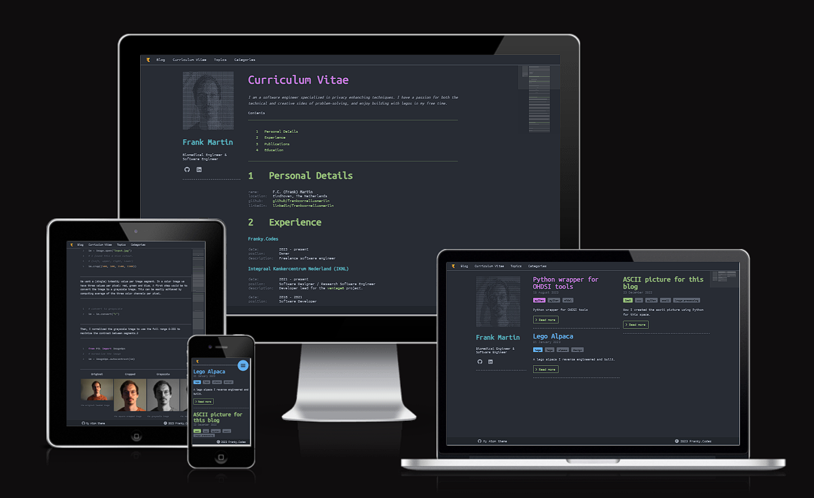

## Pelican Atom Theme

A responsive theme inspired by the VSCode and Atom.



## TODOs

- [x] Update link/text to Atom theme in the bottom
- [x] Move ASCII art picture out of the config file
- [x] Option to include image instead of ASCII art
- [x] Clean up JavaScript code
- [x] Remove the need for jQuery
- [x] Finish social media meta `X` and `open_graph`
- [x] Support blog images
- [x] Support pagination
- [x] Share options bellow post
- [ ] Option to use fa-icon for logo in the header
- [ ] Support FEEDS
- [ ] Investigate comment support, consider [Isso](https://github.com/posativ/isso)
- [ ] Add `archives`, `author`, `authors` and `period_archives` templates
- [ ] Support for translations

## Installation

- plugins:
  - pelican-share-post
  - ...

## Settings

```python
AUTHOR = 'Author'
SITENAME = 'Atom'
SITEURL = 'http://localhost:8000/'
HEADLINE = 'Atom Theme'
TIMEZONE = 'Europe/Amsterdam'
DEFAULT_LANG = 'En'
DEFAULT_PAGINATION = 10

# meta data description
DESCRIPTION = "hello world"

# Note that the key of this dict are the font-awesome classnames
SOCIALS = {
    'github': 'https://github.com/frankcorneliusmartin',
    'linkedin': 'https://www.linkedin.com/in/frankcorneliusmartin',
    'facebook': None,
    'pinterest': None
}

THEME =  Path('.') / 'atom'

STATIC_PATHS = ['images', 'extra/CNAME']

EXTRA_PATH_METADATA = {
    'extra/CNAME': {'path': 'CNAME'},
    'extra/robots.txt': {'path': 'robots.txt'},
    # expects a folder containing several files generated at:
    # https://favicon.io/favicon-converter/
    'images/favicon': {'path': 'favicon/'}
}

# Disable the use of tags, these are shown for each post on the index
# pages (e.g home and the tags page) and shown above each post on the
# post page.
SHOW_TAGS = True

# Disable the use of categories, these are shown for each post on the
# index pages (e.g home and the tags page) and shown above each post on
# the post page.
SHOW_CATEGORIE = True

# Setting this to true wil display the site name in the header next to
# the logo
DISLAY_SITE_NAME_IN_HEADER = True

# In case you have a ASCII are image you want to use. To generate one
# see https://franky.codes/ascii-picture.html. As alternative it is
# possible to provide a regular image. Make sure the dimensions of the
# ASCII picture are 220x220.
with open('content/extra/me.txt', 'r') as f:
    ASCII_PICTURE = f.read()

# In case you want a regular picture
PICTURE = 'images/me.jpg'

# Show cover pictures in the blog index. This requires the use of the
# `cover`` metadata in the post.
SHOW_COVERS = True

# Convert the cover images to grayscale. Options are:
# - 'grayscale'
# - 'grayscale-50'
# - 'grayscale-75'
# - 'opacity'
COVER_FILTER = 'opacity'


MENU_ITEMS = (
    ('Blog', SITEURL),
    ('Curriculum Vitae', f'{SITEURL}/pages/curriculum-vitae.html'),
    ('Topics', f'{SITEURL}/{TAGS_URL}'),
    ('Categories', f'{SITEURL}/{CATEGORIES_URL}'),
)

# Code blocks line numbering
PYGMENTS_RST_OPTIONS = {'linenos': 'table'}
```

## Generate Articles

## Styling Options

TODO:
- cv items
- rows of images
- code blocks
